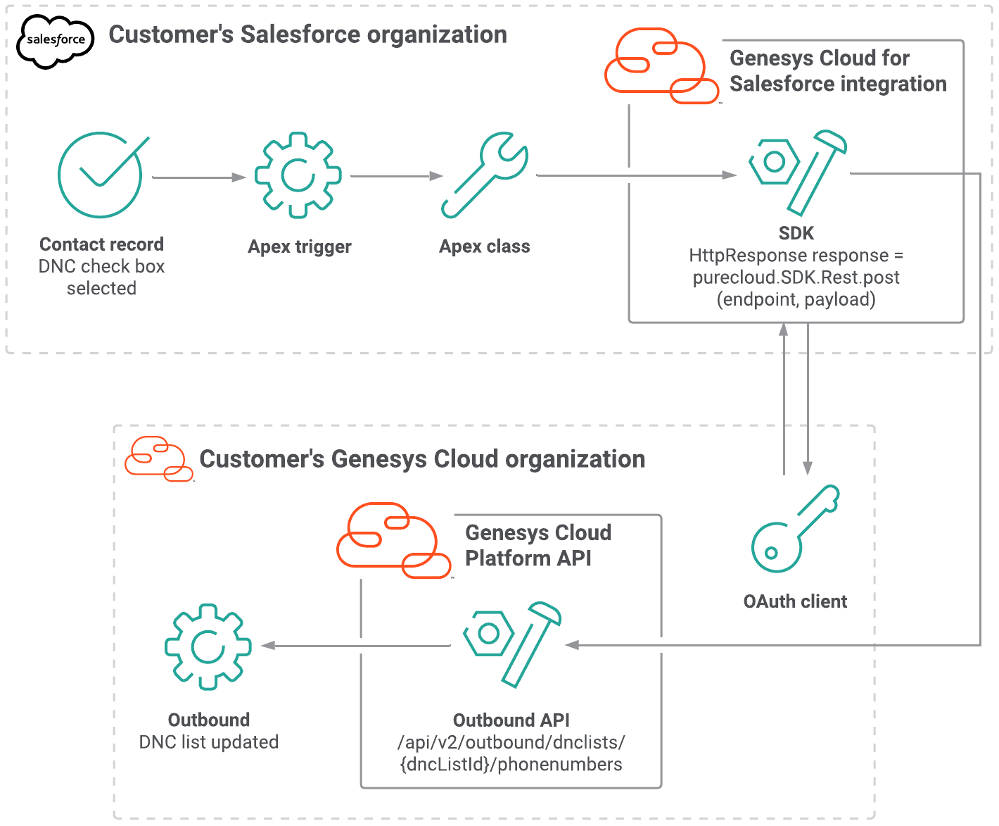
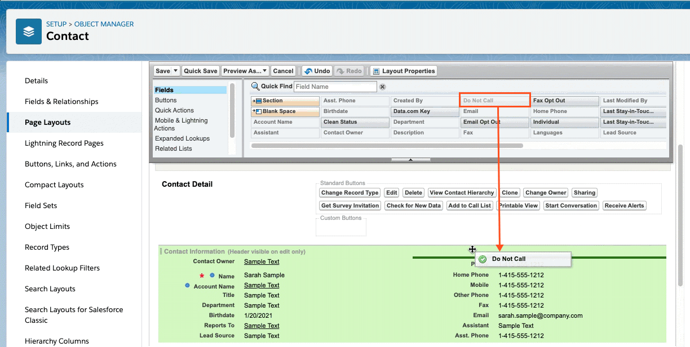

This Genesys Cloud Developer Blueprint illustrates how to use the Genesys Cloud for Salesforce SDK to add the primary phone number of a Salesforce Contact to a Genesys Cloud Do Not Contact (DNC) list. The management of DNC lists is a crucial component to campaign management. In Genesys Cloud, you create and manage DNC lists. With the Genesys Cloud for Salesforce SDK, you can integrate these lists into your Salesforce organization.

This blueprint is fully functional, but outlines a simple implementation. For a more robust implementation, you can modify it to handle multiple phone number fields (home, mobile, other) or change the code to handle bulk insert and update operations. For more information, see the [Additional resources](#additional_resources "Goes to the Additional resources section") section.



* [Solution components](#solution_components "Goes to the Solution components section")
* [Prerequisites](#prerequisites "Goes to the Prerequisites section")
* [Implementation steps](#implementation_steps "Goes to the Implementation steps section")
* [Additional resources](#additional_resources "Goes to the Additional resources section")

## Solution components

* **Genesys Cloud** - A suite of Genesys cloud services for enterprise-grade communications, collaboration, and contact center management. You create and manage DNC lists and OAuth clients in Genesys Cloud.
* **Salesforce** - The Salesforce cloud customer relationship management (CRM) platform.
* **Genesys Cloud for Salesforce** - The Genesys Cloud integration that embeds Genesys Cloud inside Salesforce.
* **Genesys Cloud for Salesforce managed package** - The managed package that contains all the installation components, including the Genesys Cloud for Salesforce SDK, necessary to run Genesys Cloud for Salesforce.
* **Genesys Cloud for Salesforce SDK** - Allows you to customize actions in Genesys Cloud for Salesforce. This SDK is included in the managed package and uses the Salesforce Apex programming language.

## Prerequisites

### Specialized knowledge

* Administrator-level knowledge of Genesys Cloud
* Administrator-level knowledge of Salesforce and programming experience with Apex code

### Genesys Cloud account

* A Genesys Cloud license. For more information, see [Genesys Cloud pricing](https://www.genesys.com/pricing "Opens the Genesys Cloud pricing page") on the Genesys website.

* The solutions engineer assigned the **Integration** > **Salesforce** > **Agent** permission. For more information, see [Administrator requirements for the Genesys Cloud embedded clients](https://help.mypurecloud.com/?p=166994 "Opens the Administrator requirements for the Genesys Cloud embedded clients article") in the Genesys Cloud Resource Center.

* An OAuth client with roles that are assigned the Campaign Management permissions and the **Outbound** > **DNC List** > **Add** permission. For more information, see [OAuth client permissions for Genesys Cloud for Salesforce](https://help.mypurecloud.com/?p=188903 "Opens the OAuth client permissions for Genesys Cloud for Salesforce article") and [Create an OAuth client](https://help.mypurecloud.com/?p=188023 "Opens the Create an OAuth client article") in the Genesys Cloud Resource Center.

### Salesforce account

* A Salesforce organization with the Genesys Cloud for Salesforce integration installed and configured. For more information, see [Install or upgrade the Genesys Cloud for Salesforce managed package](https://help.mypurecloud.com/?p=39356/ "Opens the Install or upgrade the Genesys Cloud for Salesforce managed package article") and [Set up a call center in Salesforce](https://help.mypurecloud.com/?p=10593 "Opens the Set up a call center in Salesforce article") in the Genesys Cloud Resource Center.

* The Salesforce organization and the Genesys Cloud for Salesforce integration configured for campaign management. For more information, see [Set up campaign management in Genesys Cloud for Salesforce](https://help.mypurecloud.com/?p=194714 "Opens the Set up campaign management in Genesys Cloud for Salesforce article") in the Genesys Cloud Resource Center.

* The solutions engineer assigned a System Administrator profile. For more information, see [Standard Profiles](https://help.salesforce.com/articleView?id=standard_profiles.htm&type=5 "Opens Standard Profiles") in the Salesforce documentation.

## Implementation steps

* [Create an internal DNC list in Genesys Cloud](#create_an_internal_dnc_list_in_genesys_cloud "Goes to the Create an internal DNC list in Genesys Cloud section")
* [Create a custom setting in Salesforce](#create_a_custom_setting_in_salesforce "Goes to the Create a custom setting in Salesforce section")
* [Configure the Do Not Call field in Salesforce](#configure_the_do_not_call_field_in_salesforce "Goes to the Configure the Do Not Call field in Salesforce section")
* [Create an Apex trigger and class](#create_an_apex_trigger_and_class "Goes to the Create an Apex trigger and class section")
* [Test your work](#test_your_work "Goes to the Test your work section")

### Create an internal DNC list in Genesys Cloud

1. In your Genesys Cloud organization, create an internal DNC list.

    The **assets/data/** folder in GitHub contains an example .csv file that you use. For more information, see the [genesys-cloud-for-salesforce-sdk-dnclist-example](https://github.com/GenesysCloudBlueprints/genesys-cloud-for-salesforce-sdk-dnclist-example "Opens the genesys-cloud-for-salesforce-sdk-dnclist-example repository in GitHub") repository in GitHub and [Create a new internal DNC list](https://help.mypurecloud.com/?p=4107 "Opens the Create a new internal DNC list article") in the Genesys Cloud Resource Center.

2. Copy and save the ID of the DNC list.

    You will use this ID after you create a custom field. See the [Create a custom setting in Salesforce](#create_a_custom_setting_in_salesforce "Goes to the Create a custom setting in Salesforce section") section.

    

### Create a custom setting in Salesforce

Use a custom setting to store the ID of the DNC list.

1. Create a custom setting with following values:

<div style="margin-left: 40px;">

:::primary
**Note**: If **Setting Type** is grayed out, enable **Manage List Custom Settings Type**. For more information, see [List Custom Setting is greyed out](https://help.salesforce.com/articleView?id=000317370&language=en_US&type=1&mode=1 "Opens List Custom Setting is greyed out") in the Salesforce documentation.
:::

* **Object Name**: Genesys_Cloud_DNC_List
* **Setting Type**: List

For more information, see [Create Custom Settings](https://help.salesforce.com/articleView?id=cs_about.htm&type=5 "Opens Create Custom Settings") in the Salesforce documentation.

</div>

2. Add a custom field to the custom setting with the following values:

<div style="margin-left: 40px;">

:::primary
**Note**: **Length** must be at least 36.
:::

* **Data Type**: Text
* **Length**: 36
* **Field Name**: DNC_List_Id

For more information, see [Add Custom Settings Fields](https://help.salesforce.com/articleView?id=cs_add_fields.htm&type=5 "Opens Add Custom Settings Fields") in the Salesforce documentation.

</div>

3. Add the ID of the DNC list to the custom field.

    a. Click **Setup**.

    b. Search for and click **Custom Settings**.

    c. Click **Manage** next to Genesys_Cloud_DNC_List. You created this custom field in step 1.

    d. Click **New**.

    e. For **Name**, enter **DNC_List_Id**.

    f. For **DNC_List_Id**, enter the ID of the DNC list that you copied and saved earlier. See the [Create an internal DNC list in Genesys Cloud](#create_an_internal_dnc_list_in_genesys_cloud "Goes to the Create an internal DNC list in Genesys Cloud section") section.

    g. Click **Save**.

### Configure the Do Not Call field in Salesforce

This field is hidden by default. Make the field visible to profiles and then add the field to **Contact Layout**.

1. Set **Field-Level Security** for the **Do Not Call** field to **Visible**.

    a. Find the Contact field called **Do Not Call**.

    b. Click **Set Field-Level Security**.

    c. Under **Visible**, select the profiles that you want to be able to see the **Do Not Call** field.

    d. Click **Save**.

    For more information, see [Set Field-Level Security for a Single Field on All Profiles](https://help.salesforce.com/articleView?id=users_fields_fls.htm&type=5 "Opens Set Field-Level Security for a Single Field on All Profiles") in the Salesforce documentation.

2. Add **Do Not Call** to **Contact Layout**.

    a. Open the page layout for Contacts.

    b. Drag the **Do Not Call** field to the **Contact Information** section.

    c. Click **Save**.

    For more information, see [Page Layouts](https://help.salesforce.com/articleView?id=customize_layout.htm&type=5 "Opens Page Layouts") in the Salesforce documentation.

    

    A **Do Not Call** check box now appears on all Contact records in Salesforce for the profiles that you selected.

### Create an Apex trigger and class

This solution uses an Apex trigger and an Apex class to capture the selection of a check box and call the Genesys Cloud Platform API. If during an insert or update the **Do Not Call** field is selected, the trigger code calls a custom class that connects to the Genesys Cloud Platform API and adds the phone number of the Contact to the DNC list.

Because the SDK makes asynchronous calls to the Genesys Cloud Platform API, the class method must include a `future` annotation. The `future` annotation designates the callout as asynchronous.

For more information, see [Classes](https://developer.salesforce.com/docs/atlas.en-us.apexcode.meta/apexcode/apex_classes_understanding.htm "Opens Classes") and [Future Annotation](https://developer.salesforce.com/docs/atlas.en-us.apexcode.meta/apexcode/apex_classes_annotation_future.htm?search_text=@future "Opens Future Annotation") in the Salesforce Apex Developer Guide.

1. Create the **`DoNotCallManager`** class in Salesforce

    a. In the Developer Console, click **File** > **New** > **Apex Class**.

    b. For the class name, enter **DoNotCallManager** and then click **OK**.

    c. Replace the default code with the code found at `src/classes/DoNotCallManager.cls`.

    d. Save the file.

<div style="margin-left: 40px;">

:::primary
**Tip**: The `addPhoneNumber` method in the `DoNotCallManager` class uses the SDK to add the phone number to the DNC list with a POST request to `/api/v2/outbound/dnclists/{dncListId}/phonenumbers`. This solution only adds a single phone number per request, but this endpoint can handle multiple phone numbers in a single request.<br><br>

The following Apex code is a simplified example of the SDK request in the `addPhoneNumber` method. The code uses the POST method of the SDK to send a request containing an array of phone numbers to the API endpoint.<br><br>

```
String payload = JSON.serialize(new List<String>{ phoneNumber });

HttpResponse response = purecloud.SDK.Rest.post(
'/api/v2/outbound/dnclists/{dncListId}/phonenumbers', payload );
```
:::

</div>

2. Create the **Contact** trigger in Salesforce

    a. In the Developer Console, click **File** > **New** > **Apex Trigger**.

    b. For **Name**, enter **ContactTrigger**.

    c. For **sObject**, select **Contact**.

    d. Replace the default code with the code found at `src/triggers/ContactTrigger.trigger`.

    e. Save the file.

### Test your work

1. In Salesforce, create a **Contact** and select the **Do Not Call** check box.
2. In Genesys Cloud, export the DNC list that you created earlier.

    The phone number of your new Contact appears in the exported .csv file. For more information, see [Download DNC records](https://help.mypurecloud.com/?p=39880 "Opens the Download DNC records article") in the Genesys Cloud Resource Center.

## Additional resources

* [Do not contact lists view](https://help.mypurecloud.com/?p=44349 "Opens the Do not contact lists view article") in the Genesys Cloud Resource Center
* [Salesforce Execution Governors and Limits](https://developer.salesforce.com/docs/atlas.en-us.apexcode.meta/apexcode/apex_gov_limits.htm "Opens Salesforce Execution Governors and Limits") in the Salesforce Apex Developer Guide
* [Bulk Triggers](https://developer.salesforce.com/docs/atlas.en-us.apexcode.meta/apexcode/apex_triggers_bulk.htm "Opens Bulk Triggers") in the Salesforce Apex Developer Guide
* [Troubleshoot the Genesys Cloud embedded clients](https://help.mypurecloud.com/?p=167230 "Opens the Troubleshoot the Genesys Cloud embedded clients article") in the Genesys Cloud Resource Center
* [Platform API: Troubleshooting](https://developer.mypurecloud.com/api/rest/index.html#troubleshooting "Opens the Troubleshooting section in the Platform API page")
* [About Genesys Cloud for Salesforce](https://help.mypurecloud.com/?p=65221 "Opens the About Genesys Cloud for Salesforce article") in the Genesys Cloud Resource Center
* [About Campaign Management in Genesys Cloud for Salesforce](https://help.mypurecloud.com/?p=153769 "Opens the About Campaign Management in Genesys Cloud for Salesforce") in the Genesys Cloud Resource Center
* The [genesys-cloud-for-salesforce-sdk-dnclist-example](https://github.com/GenesysCloudBlueprints/genesys-cloud-for-salesforce-sdk-dnclist-example "Opens the genesys-cloud-for-salesforce-sdk-dnclist-example repository in GitHub") repository in GitHub

This content is [licensed](https://github.com/GenesysCloudBlueprints/genesys-cloud-for-salesforce-sdk-dnclist-example/blob/master/LICENSE "Opens the MIT License in GitHub") under the MIT license.
